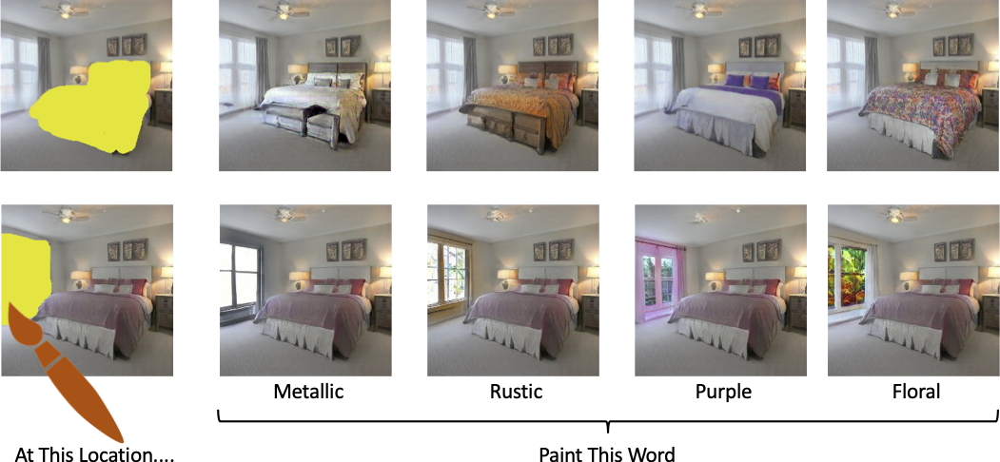
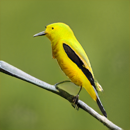
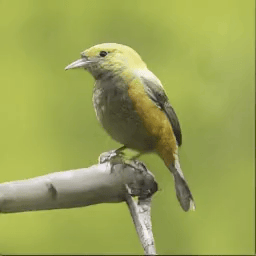

# Paint By Word

<!-- ## [video (5m)](TODO) | [website]() | [paper](https://arxiv.org/abs/2103.10951) -->



We provide a PyTorch implementation of our Paint By Word Method presented in [this paper](https://arxiv.org/abs/2103.10951).

## Prerequisites

- Linux or macOS
- Python 3.6+
- CPU or NVIDIA GPU + CUDA CuDNN

**Table of Contents:**

1. [Setup](#setup)
1. [Painting](#painting)

## Setup

- Clone this repo:

```bash
git clone https://github.com/alexandonian/paint-by-word.git
cd paint-by-word
```

- Create python virtual environment

- Install a recent version of [PyTorch](https://pytorch.org/get-started/locally/) and other dependencies specified below.

We highly recommend that you install additional dependencies in an isolated python virtual environment (of your choosing). For Conda+pip users, you can create a new conda environment and then pip install dependencies with the following snippet:

```bash
conda env create -f scripts/environment.yml
conda activate paintbyword
pip install -e .
./scripts/setup_env.sh
```
## Painting

### Free form painting with words:

```python
from paintbyword import StyleganPainter
from paintbyword.utils import show, pilim

# Create instance of painter class
painter = StyleganPainter(pretrained='birds')

seed_index = 0
z, image, loss_history, im_history = painter.paint(
  seed_index,
  'A photo of a yellow bird with black colored wings',
  optim_method='cma + adam'
)

# Show the painted output image.
show(pilim(image[0]))
```
should produce an image similar to the one below on the right with the optimization history on the left:
<!-- Insert image -->



### Masked painting with words:
```python
from paintbyword import StyleganMaskedPainter
from paintbyword.utils import show, pilim

# Create instance of masked painter class
painter = StyleganMaskedPainter(pretrained='bedroom')

# Display grid of seed images to choose from
painter.show_seed_images(batch_size=32)

choice = 30  # Choose index of desired seed image.
painter.mask_seed_image(choice)  # Scribble mask on seed image.
```


```python
result = painter.paint(
    choice,
    description='A photo of a rustic bed',
    optim_method='cma + adam'
)
# Show the painted output image.
show(pilim(image[0]))
```


For complete working examples, please see the juypter notebooks in the `notebooks` directory.


### Citation

If you use this code for your research, please cite our [paper](https://arxiv.org/abs/2103.10951).

```bash
@article{bau2021paint,
  title={Paint by word},
  author={Bau, David and Andonian, Alex and Cui, Audrey and Park, YeonHwan and Jahanian, Ali and Oliva, Aude and Torralba, Antonio},
  journal={arXiv preprint arXiv:2103.10951},
  year={2021}
}
```
